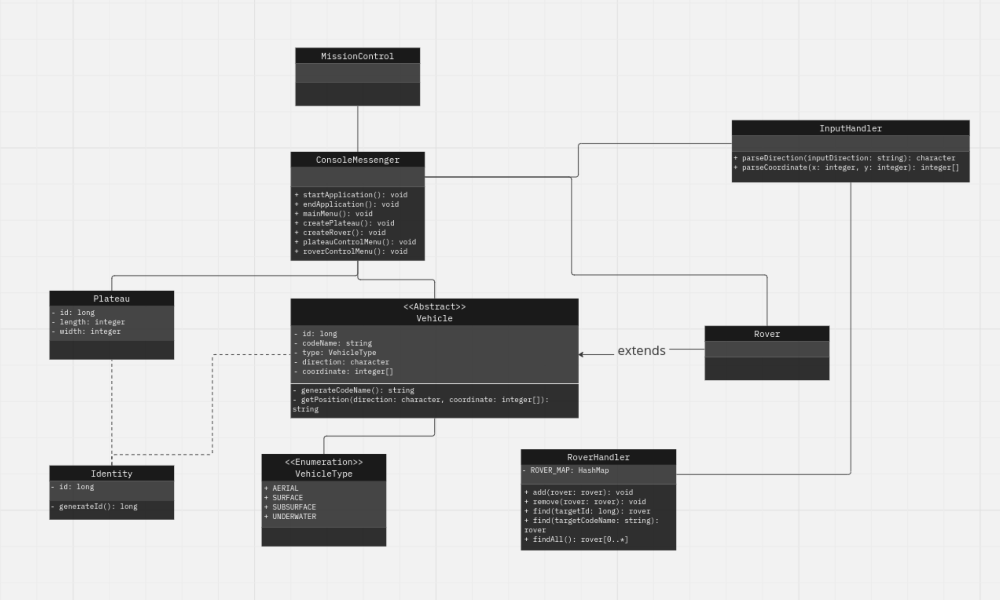

# Mars Rover Mission

The Mars Rover is a program in which a rover is able to traverse the surface of Mars, confined to plateaus which are four-sided grids on the surface that have been defined as areas for collecting samples for research.
A user is able to define a plateau, deploy a rover and then feed instructs to the rover to control its journey across the plateau.

### Table of Contents
The documentation of Mars Rover includes:

<u>

- [User Guide](#user-guide)
- [Class Structure](#class-structure)
- [Testing](#example-test-cases)
- [Scalability](#future-implementations)

</u>

 

## User Guide
1. The program will display an interface within the console

2. The program will prompt the user to enter details for the plateau and rover
   - Plateau dimensions (length and width) are expected as integer inputs
   - Rover direction (compass point) is expected as string (i.e. North, East, South, West)
   - Rover start position comprises cardinal direction (North, East, South, West) and coordinate (X,Y)

3. The program will display details of the plateau and deployed rover(s), indicating successful initialisation

4. The program will prompt the user to enter instructions as a string of character commands
   - Valid Commands
     - `L` turn left (rotate -90deg)
     - `R` turn right (rotate 90deg)
     - `M` advance one unit
     - *The assumption is that the rover cannot reverse*

5. The program will return the new position of the rover

6. (Conditional) The program may return any remaining instructions*
 
*Users have the option to continue providing instructions in a loop or to exit the program.*

*If rover coordinates exceed the dimensions of the plateau, the rover will execute instructions to the best of its ability and return any remaining instructions.

 

### Class Structure
`MissionControl` serves as the entry point for the application.

Models `Plateau`, `Vehicle`, and `Rover`, are responsible for managing data associated with the planetary surface (plateau) and the vehicle (rover) traversing it.
 

The View `ConsoleMessenger` functions as the view, handling the user interface layer of the program and facilitating user input.
 

Controllers `InputHandler` and `RoverHandler`, manage user input, processing it as it passes through the view and enabling the core functionality of the application.

 

`VehicleType` is an enumeration describing the type of Vehicle (i.e. surface, underwater, etc.)

`Identity` is a class for generating identifiers of type `Long` within the program.

 
 

 

## Testing
### Example Test Cases

The examples outline the expected input and output in various cases.

The program will receive three lines of input, namely Input A, Input B and Input C respectively.

`A` describes the dimensions of the plateau as lengths of the X and Y axes respectively.  
`B` describes the start position of the rover as coordinates (x, y).  
`C` is a string of alphabetical characters instructing the rover across the plateau.  

| Test Case | Input A | Input B | Input C | Expected Output |
|-----------|---------|---------|---------|-----------------|
| 1         |         |         |         |                 |
| 2         |         |         |         |                 |
| 3         |         |         |         |                 |
| 4         |         |         |         |                 |
| 5         |         |         |         |                 |

*Test cases will follow the naming convention as outlined within [this article](https://www.softwaretestingmagazine.com/knowledge/how-to-choose-the-right-name-for-unit-tests/) for explicit test names that describe the expected result and the conditions required to achieve them.*

## Scalability
### Future Implementations

- Can this be visualised as a grid in the console or as a web application?
- 
- Can multiple rovers be sent out?
  - How will they be controlled?
  - How will the user select which rover to control or view their positions?
  - How will instructions be validated to prevent rovers colliding with each other?

- Implement generics within RoverHandler to perform operations on any child of Vehicle?