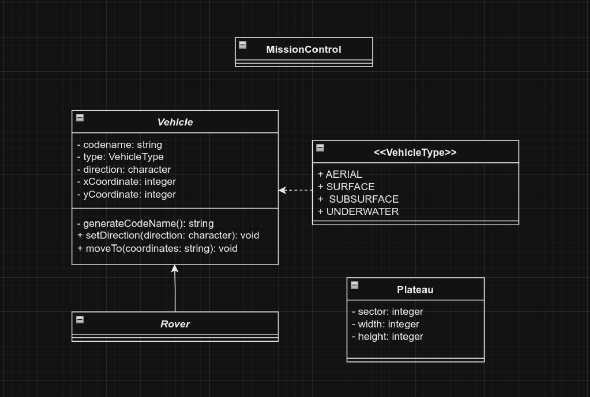

# Mars Rover Application

### Brief
Create a program to control rovers on the surface of Mars, which is represented by a plateau, which will be a 4-sided grid in this context.

The Minimum Viable Product (MVP) has the functionality to create a rover and plateau, place a rover and instruct the rover.

 

#### Key Features
- The user will be able to...
  - define the XY dimensions of a plateau
  - input instructions to move the rover
  - view the position of the rover

- The program will be able to...
  - validate user input
  - create a plateau from dimensions
  - place rover at position 0,0
  - parse instructions from user input

 

#### Assumptions & Approach
- If coordinates exceed the dimensions of the plateau, the rover will carry out the instructions as well as it can and return the remaining instructions.
- Basic flow pattern
  - User input is requested
    - Plateau dimensions
    - Rover start position
  - Program creates plateau and rover
  - User is prompted to give instructions to move the rover
  - Program returns new position of rover
  - (Conditional) Program returns remaining instructions
    
  - *User is able to continue in the loop of providing instructions or end program*

#### Classes

- Rover
  - Attributes
    - ID: An identifier that will increment for each instance of the class
    - Codename: A unique codename generated by combining the type and ID (e.g. "Surface-1")
    - Type: An enumeration defining the type of rover (aerial, surface, subsurface, underwater)
    - Direction: The direction in relation to the cardinal points of a compass
    - X Coordinate: The position along the X-axis
    - Y Coordinate The position along the Y-axis

- Plateau
  - Attributes
    - Sector: A string identifier assigned to each instance of the class (e.g. Sector-1)
    - Width: The size of the grid ("plateau") along the X-axis
    - Length: The size of the grid ("plateau") along the Y-axis

 

 

### Example Test Cases
Below are examples of test cases that describe the expected output when given a specific start point (Input A) and instruction (Input B).

| Test Case | Input A    | Input B | Expected Output |
|-----------|------------|---------|-----------------|
| 1         | 5 5        | 1 2 N   | 1 3 N           |
| 2         | LMLMLMLMM  | 3 3 E   | 5 1 E           |
| 3         | MMRMMRMRRM |         |                 |
| 4         |            |         |                 |
| 5         |            |         |                 |

Test cases will follow the naming convention as outlined within [this article](https://www.softwaretestingmagazine.com/knowledge/how-to-choose-the-right-name-for-unit-tests/) for explicit test names that describe the expected result and the conditions required to achieve them.

The designation is as follows "MethodName_ExpectedBehavior_StateUnderTest", for example "generateCodeName_ReturnsCodeName_IfRoverIsInstantiated".

### Future Implementations
- Can this be visualised as a grid in the console or as a web application?

- Can multiple rovers be sent out?
  - How will they be controlled?
  - How will the user select which rover to control or view their positions?
  - How will instructions be validated to prevent rovers colliding with each other?